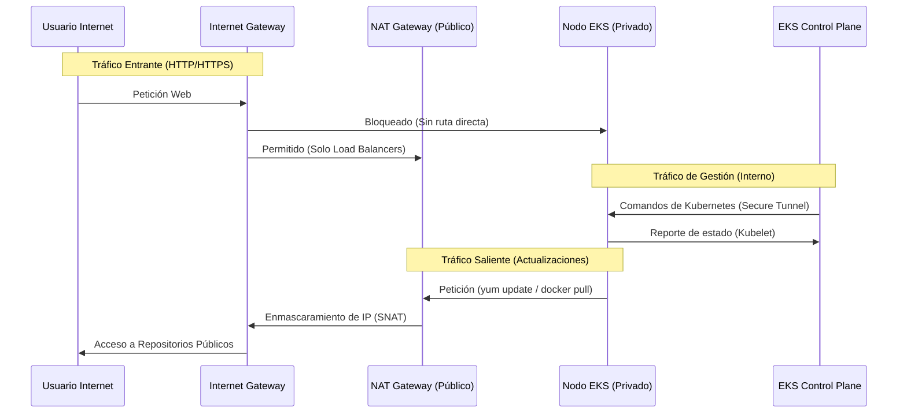

# 🏛️ Documento de Diseño de Arquitectura (ADR)

> **Proyecto:** AWS EKS Enterprise Ingress Architecture
> **Estado:** Implementado / Validado
> **Owner:** DevOps Team

Este documento detalla las decisiones de diseño, patrones de arquitectura y estrategias de seguridad implementadas en este laboratorio.

---

## 1. Visión General del Diseño

El objetivo principal de esta arquitectura es proveer un entorno de orquestación de contenedores (Kubernetes) que cumpla con los estándares de **Seguridad**, **Alta Disponibilidad** y **Escalabilidad** requeridos en entornos empresariales, manteniendo el código **DRY** (Don't Repeat Yourself) mediante Terragrunt.

---

## 2. Decisiones de Arquitectura (The "Why")

### 2.1 Estrategia de Red (VPC Tiering)
Se eligió una topología de **"Pública/Privada"** estricta para garantizar la seguridad de los datos.

* **CIDR Block:** `10.0.0.0/16` (65,536 IPs disponibles).
* **Subnetting:**
    * **Capa Pública (`10.0.1.0/24`, `10.0.2.0/24`):** Únicamente para balanceadores de carga (ALB) y NAT Gateways. Nada que almacene datos vive aquí.
    * **Capa Privada (`10.0.101.0/24`, `10.0.102.0/24`):** Aquí residen los Nodos de EKS y (futuramente) bases de datos. **No tienen acceso directo desde internet.**

**¿Por qué?** Reduce drásticamente la superficie de ataque. Incluso si el firewall de un nodo falla, no se puede acceder a él desde internet porque no tiene IP pública.

### 2.2 Motor de Cómputo (EKS Managed Node Groups)
Utilizamos **Managed Node Groups** en lugar de instancias EC2 "Self-Managed".

**Beneficios:**
* AWS se encarga del parcheo del sistema operativo (AMI patching).
* Escalado automático (Auto Scaling Group) integrado.
* Registro y drenado de nodos automático durante actualizaciones.

### 2.3 Infraestructura como Código (Terragrunt Wrapper)
En lugar de Terraform puro, utilizamos **Terragrunt** para envolver la configuración.

**Problema que resuelve:**
En Terraform tradicional, para tener `dev` y `prod`, tendrías que copiar y pegar el código de los recursos (`main.tf`), violando el principio DRY.

**Solución Implementada:**
* **Módulos (Terraform):** Contienen la lógica "tonta" (ej: "crear un cluster").
* **Live (Terragrunt):** Contiene los valores "inteligentes" (ej: "prod tiene 5 nodos", "dev tiene 1 nodo").

---

## 3. Diagrama de Flujo de Datos

---

## 4. Estrategia de Seguridad (Security Posture)

### 4.1 IAM Roles for Service Accounts (IRSA)
**Principio de Menor Privilegio.**
En lugar de darle permisos de "Administrador" al nodo entero, asignamos roles de IAM específicos a cada **Pod**.
* *Ejemplo:* Si el driver de disco (`ebs-csi`) necesita tocar discos, solo ESE pod tiene permiso. El pod de `nginx` no tiene permisos de AWS.

### 4.2 Security Groups (Firewalls Virtuales)
* **Cluster SG:** Permite tráfico entre el Control Plane y los Nodos (puerto 443, 10250).
* **Node SG:** Permite tráfico entre nodos (para que los pods se hablen entre sí).
* **Bloqueo por defecto:** Todo el tráfico entrante está denegado salvo que se especifique lo contrario.

---

## 5. Consideraciones de FinOps (Costos)

Para evitar sorpresas en la facturación, la arquitectura incluye mecanismos de control:

1.  **Spot Instances (Preparado):** El código soporta `capacity_type = "SPOT"`, lo que podría reducir costos en un 70% para entornos no productivos.
2.  **NAT Gateway Único:** En entornos de desarrollo, se puede configurar `single_nat_gateway = true` para ahorrar $0.045/h por zona de disponibilidad extra.
3.  **Auditoría Automática:** Script `audit_resources.sh` incluido en el repositorio para detectar recursos huérfanos post-destrucción.

---

## 6. Deuda Técnica y Futuras Mejoras

* [ ] Implementar **AWS Karpenter** para un autoescalado de nodos más rápido y eficiente.
* [ ] Agregar **Ingress Controller (Nginx/ALB)** para exponer aplicaciones HTTP de forma real.
* [ ] Integrar **Prometheus & Grafana** para observabilidad métrica.
