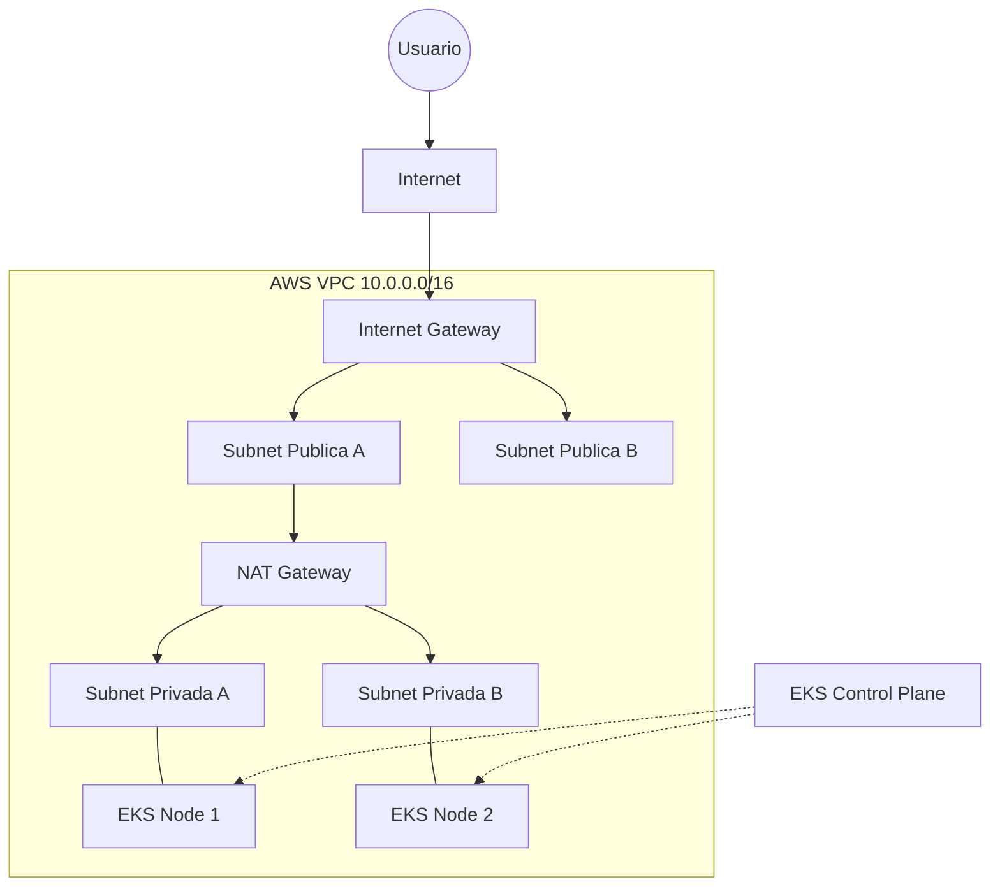

# ☁️ AWS EKS Enterprise Architecture | IaC with Terragrunt


> **"Infraestructura inmutable, segura y escalable para cargas de trabajo críticas."**

Este repositorio contiene una implementación completa de un clúster **Kubernetes (EKS)** listo para producción, utilizando **Terraform** y **Terragrunt** bajo la filosofía **DRY** (Don't Repeat Yourself) y principios de **FinOps**.

---

## 🏗️ Arquitectura del Laboratorio

Esta arquitectura despliega una red VPC aislada y un clúster EKS con nodos gestionados, siguiendo las mejores prácticas de seguridad (Nodos en subnets privadas, NAT Gateway para salida a internet).

### Diagrama de Infraestructura



### 🧩 Componentes Tecnológicos
* **Orquestación:** Terraform & Terragrunt.
* **Nube:** AWS (Región: `us-east-1`).
* **Red:** VPC Modular con Subnets Públicas/Privadas y NAT Gateway.
* **Cómputo:** EKS (Control Plane) + Managed Node Groups (Instancias `t3.medium`).
* **Addons:** CoreDNS, VPC-CNI, Kube-Proxy (Gestión automatizada por Terraform).
* **Seguridad:** IAM Roles for Service Accounts (IRSA).
* **FinOps:** Scripts de auditoría automatizada y destrucción limpia.

---

## 🎯 Objetivos de Aprendizaje

Este laboratorio está diseñado para enseñar:
1.  **IaC Modular:** Separación estricta entre código (`modules`) y configuración (`live`).
2.  **Gestión de Dependencias:** Orquestación del orden de despliegue (VPC antes que EKS) usando Terragrunt.
3.  **Troubleshooting Senior:** Resolución de conflictos de versiones (AWS Provider v5 vs v6) y manejo de "Race Conditions" en addons.
4.  **Estrategia FinOps:** Cómo auditar recursos huérfanos para garantizar **Costo $0** al apagar el laboratorio.

---

## 📂 Estructura del Repositorio

```text
.
├── live/                   # 🧠 EL CEREBRO (Instanciación de entornos)
│   ├── root.hcl            # Configuración global (State Bucket, Provider Version)
│   └── prod/               # Entorno de Producción
│       ├── vpc/            # Instancia de la Red
│       └── eks/            # Instancia del Clúster
├── modules/                # 💪 EL MÚSCULO (Código Reutilizable - Terraform puro)
│   ├── vpc-network/        # Definición de VPC, Subnets, IGW, NAT
│   ├── eks-cluster/        # Definición de EKS, Nodos, IAM, Addons
│   └── k8s-addons/         # (Placeholder) Futuros Helm charts
└── scripts/                # 🛠️ HERRAMIENTAS DE AUTOMATIZACIÓN
    ├── 00_init_backend.sh  # Crea el Bucket S3 para el tfstate y DynamoDB
    ├── audit_resources.sh  # Auditoría exhaustiva de costos (FinOps)
    └── destroy_all.sh      # Script de destrucción segura
```

---

## 🚀 Guía de Inicio (Paso a Paso)

Sigue este orden estricto para levantar el laboratorio con éxito.

### Fase 0: Prerrequisitos
Asegúrate de tener instalado y configurado:
* AWS CLI (`aws configure`)
* Terraform (`>= 1.10`)
* Terragrunt
* Kubectl

### Fase 1: Inicialización del Backend (S3 + DynamoDB)
Terraform necesita un lugar remoto para guardar el estado del sistema.

```bash
chmod +x scripts/*.sh
./scripts/00_init_backend.sh
```

### Fase 2: Despliegue de la Red (VPC)
Construimos la carretera antes que los coches.

```bash
cd live/prod/vpc
terragrunt init
terragrunt apply -auto-approve
```
* **Tiempo estimado:** 2-3 minutos.
* **Nota:** A partir de aquí el NAT Gateway empieza a facturar ($0.045/h).

### Fase 3: Despliegue del Clúster (EKS)
El cerebro de Kubernetes y los nodos de trabajo.

```bash
cd ../eks
terragrunt init
terragrunt apply -auto-approve
```
* **Tiempo estimado:** 15-20 minutos.
* **Troubleshooting:** Si ves un error de *Timeout* relacionado con `aws-ebs-csi-driver`, vuelve a ejecutar el comando `apply`. Es una condición de carrera conocida en cuentas nuevas.

### Fase 4: Validación (Prueba de Fuego)
Confirmamos que el clúster está vivo y puede ejecutar aplicaciones.

```bash
# 1. Configurar contexto local de Kubernetes
aws eks update-kubeconfig --region us-east-1 --name eks-enterprise-prod

# 2. Verificar estado de los nodos
kubectl get nodes

# 3. Desplegar una app de prueba (Nginx)
kubectl run nginx --image=nginx
kubectl get pods -w
```
*(Debes ver el estado pasar de `Pending` -> `ContainerCreating` -> `Running`)*.

---

## 💰 Estimación de Costos (FinOps)

Mantener este laboratorio encendido cuesta aproximadamente **$0.23 USD por hora**.

| Recurso | Detalle | Costo Aprox. |
| :--- | :--- | :--- |
| **EKS Control Plane** | Tarifa fija por clúster | $0.10 / h |
| **NAT Gateway** | 1 por zona pública | $0.045 / h |
| **EC2 Instances** | 2 nodos t3.medium | $0.083 / h |
| **EBS Volumes** | 2 discos de 20GB | ~$0.005 / h |
| **TOTAL** | | **~$0.23 USD / Hora** |

---

## 💣 Limpieza Total (Destrucción Segura)

Para evitar costos sorpresa, sigue este procedimiento de destrucción inversa.

**⚠️ IMPORTANTE:** No borres la VPC si el EKS sigue vivo, o dejarás recursos "zombies" que cobran dinero.

1.  **Paso 1: Destruir EKS** (~10 min)
    ```bash
    cd live/prod/eks
    terragrunt destroy -auto-approve
    ```

2.  **Paso 2: Destruir VPC** (~2 min)
    ```bash
    cd ../vpc
    terragrunt destroy -auto-approve
    ```

3.  **Paso 3: Auditoría Final (Crucial)**
    Ejecuta el script de auditoría para confirmar que no quedó nada vivo (especialmente NAT Gateways o Discos).
    ```bash
    cd ../../../
    ./scripts/audit_resources.sh
    ```
    *Busca el mensaje: `[✔] ... : Limpio (0 encontrados)`*

---

## 🏆 Mejores Prácticas Aplicadas en este Lab

* **Version Pinning:** Uso de `~> 5.0` en AWS Provider para evitar *breaking changes* automáticos.
* **State Locking:** Uso de DynamoDB para evitar corrupción del estado si dos personas despliegan a la vez.
* **Least Privilege:** Uso de roles IAM específicos para los nodos.
* **Component Bypass:** Gestión de errores en addons no críticos (`ebs-csi-driver`) para priorizar la estabilidad de la red.

---

_Project maintained by Jose | AWS DevOps Lab 2026_
